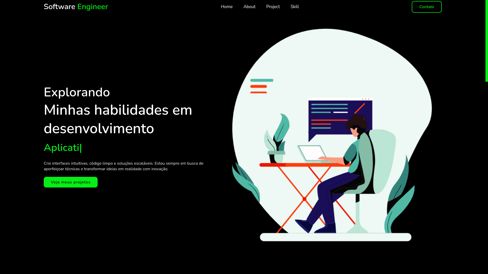
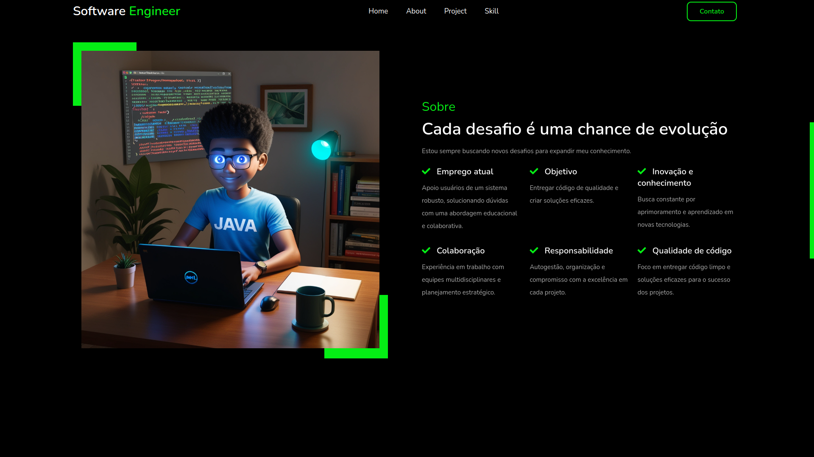

# Portfólio dos projetos e apresentação

## 🚀 Motivaçao / objetivo

Uma landing page online para minha apresentação e dos meus projetos.

<h1 align="center">
  
  
</h1>

## 💻 Requisitos

Antes de iniciar, você deve ter o Node.js e o YARN instalados em sua máquina.

## 🚀 Instalando

Primeiro, você deve clonar o projeto na sua máquina, para isso você
pode colar o seguinte comando em seu terminal

```bash
git clone https://github.com/Tiago-Silva/portfolio-02.git
```
Para instalar as dependências, execute o seguinte comando:

```bash
yarn install
```

O projeto é em apenas Html, Css e javascript, então abra o arquivo no seu navegador


### Features

Tecnologias usadas nesse projeto:

<!-- Ícones de tecnologias. Você pode encontrar esses ícones em sites como https://simpleicons.org/ -->
<p align="center">
  <a href="https://skillicons.dev">
    
  </a>
</p>

## 📝 Licença

Este projeto está licenciado sob a licença MIT. Consulte o arquivo `LICENSE` para obter mais informações.
